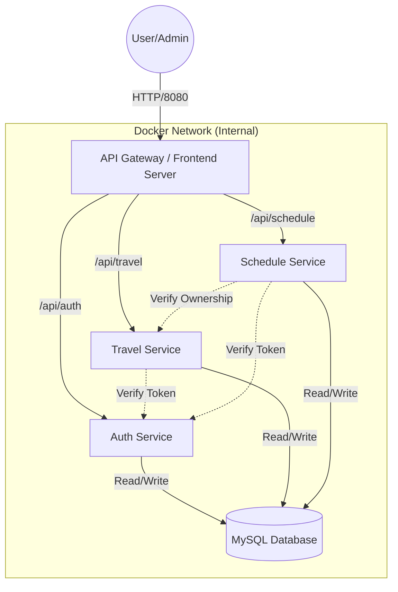

# ✈️ MSA Travel Itinerary Platform (여행 일정 관리 플랫폼)

**MSA Travel Itinerary Platform**은 마이크로서비스 아키텍처(Microservices Architecture)를 기반으로 설계된 현대적인 여행 일정 관리 웹 애플리케이션입니다.
사용자는 직관적인 **프리미엄 UI**를 통해 여행 계획을 세우고, 관리자는 **전용 대시보드**를 통해 플랫폼을 관리할 수 있습니다.

---

## 🏗️ 시스템 아키텍처 (Architecture)

이 프로젝트는 **3-Tier Architecture**와 **MSA** 패턴을 따르며, 모든 컴포넌트는 Docker 컨테이너로 격리되어 실행됩니다.



### 🧩 핵심 컴포넌트
1.  **Frontend (Nginx + Vanilla JS)**:
    *   단일 페이지 애플리케이션(SPA)으로, 부드러운 사용자 경험을 제공합니다.
    *   Nginx가 정적 파일을 서빙함과 동시에 **API Gateway** 역할을 수행하여 백엔드 서비스로 트래픽을 라우팅합니다.
2.  **Backend Microservices**:
    *   **Auth Service**: 사용자 인증(JWT 발급), 회원가입, 관리자 기능을 담당합니다.
    *   **Travel Service**: 여행지(Trip)의 생성, 조회, 삭제를 관리합니다.
    *   **Schedule Service**: 각 여행지의 세부 일정(Activity)을 관리합니다.
3.  **Database (MySQL)**:
    *   모든 서비스가 공유하는 데이터베이스로, 서비스별로 테이블이 논리적으로 분리되어 있습니다 (`users`, `travels`, `schedules`).

---

## ✨ 주요 기능 (Features)

### 👤 일반 사용자 (User)
*   **보안 로그인**: JWT(JSON Web Token) 기반의 안전한 인증 시스템.
*   **여행 관리**: 나만의 여행 카드를 생성하고, 직관적인 그리드 뷰에서 관리.
*   **상세 일정**: 각 여행별로 날짜, 장소, 메모가 포함된 타임라인 형태의 일정 관리.
*   **반응형 UI**: 데스크탑과 모바일 환경 모두에 최적화된 TailwindCSS 디자인.

### 🛡️ 관리자 (Admin)
*   **자동 권한 부여**: 아이디가 `admin`인 계정은 자동으로 관리자 권한 획득.
*   **관리자 대시보드**: 일반 사용자는 접근할 수 없는 전용 관리 페이지.
*   **사용자 제어**: 전체 가입자 목록을 실시간으로 조회하고, 불량 사용자를 강제 탈퇴 처리.
*   **콘텐츠 모니터링**: 플랫폼 내의 모든 여행 일정을 조회하고, 부적절한 게시물을 삭제.

---

## 🛠️ 기술 스택 (Tech Stack)

| 분류 | 기술 | 설명 |
|---|---|---|
| **Frontend** | HTML5, JavaScript | 가볍고 빠른 Vanilla JS SPA 구현 |
| **Styling** | **TailwindCSS** | 모던하고 세련된 UI 디자인 프레임워크 |
| **Backend** | **Python FastAPI** | 고성능 비동기 REST API 서버 |
| **Database** | MySQL 8.0 | 안정적인 관계형 데이터베이스 |
| **Infrastructure** | **Docker Compose** | 멀티 컨테이너 오케스트레이션 |
| **Server** | Nginx | 고성능 웹 서버 및 리버스 프록시 |

---

## 🚀 시작하기 (Getting Started)

### 1. 사전 요구사항
*   Docker 및 Docker Compose가 설치되어 있어야 합니다.

### 2. 설치 및 실행
터미널을 열고 다음 명령어를 순서대로 실행하세요.

**1) 프로젝트 복제**
```bash
git clone https://github.com/moveho/msa_travel_platform.git
cd msa_travel_platform
```

**2) 환경 변수 설정**
기본 제공되는 예제 파일을 복사하여 설정을 완료합니다.
```bash
cp .env.example .env
```

**3) 서비스 실행**
Docker Compose를 사용하여 모든 서비스를 빌드하고 실행합니다.
```bash
docker-compose up --build
```

### 3. 접속 방법
*   **메인 접속**: 브라우저에서 [http://localhost:8080](http://localhost:8080) 으로 접속하세요.
*   **관리자 체험**: 회원가입 시 Username을 **`admin`**으로 설정하면 관리자 기능을 체험할 수 있습니다.

---

## 🔌 API 명세 (API Endpoints)

### Auth Service
| Method | Endpoint | Description | Auth Required |
|---|---|---|---|
| `POST` | `/api/auth/signup` | 회원가입 | No |
| `POST` | `/api/auth/token` | 로그인 (JWT 발급) | No |
| `GET` | `/api/auth/users` | 전체 사용자 조회 | **Admin** |
| `DELETE` | `/api/auth/users/{id}` | 사용자 삭제 | **Admin** |

### Travel Service
| Method | Endpoint | Description | Auth Required |
|---|---|---|---|
| `GET` | `/api/travel/travels` | 내 여행 목록 조회 | Yes |
| `POST` | `/api/travel/travels` | 여행 생성 | Yes |
| `DELETE` | `/api/travel/travels/{id}` | 여행 삭제 | Yes |
| `GET` | `/api/travel/admin/travels` | 전체 여행 조회 | **Admin** |

### Schedule Service
| Method | Endpoint | Description | Auth Required |
|---|---|---|---|
| `GET` | `/api/schedule/schedules` | 상세 일정 조회 | Yes |
| `POST` | `/api/schedule/schedules` | 일정 추가 | Yes |
| `DELETE` | `/api/schedule/schedules/{id}` | 일정 삭제 | Yes |

---

## 📂 프로젝트 구조 (Directory Structure)

```bash
msa_travel_platform/
├── auth-service/       # [Backend] 인증 및 사용자 관리
│   ├── main.py         # FastAPI 애플리케이션 진입점
│   └── Dockerfile      # Python 환경 설정
├── travel-service/     # [Backend] 여행지 관리
├── schedule-service/   # [Backend] 일정 관리
├── frontend/           # [Frontend] 웹 애플리케이션
│   ├── public/         # HTML, JS, CSS 정적 파일
│   ├── nginx.conf      # API Gateway 설정
│   └── Dockerfile      # Nginx 컨테이너 설정
├── mysql/              # [Database] 초기화 스크립트
├── docker-compose.yml  # 전체 서비스 통합 설정
└── .env                # 환경 변수 (DB 접속 정보 등)
```
