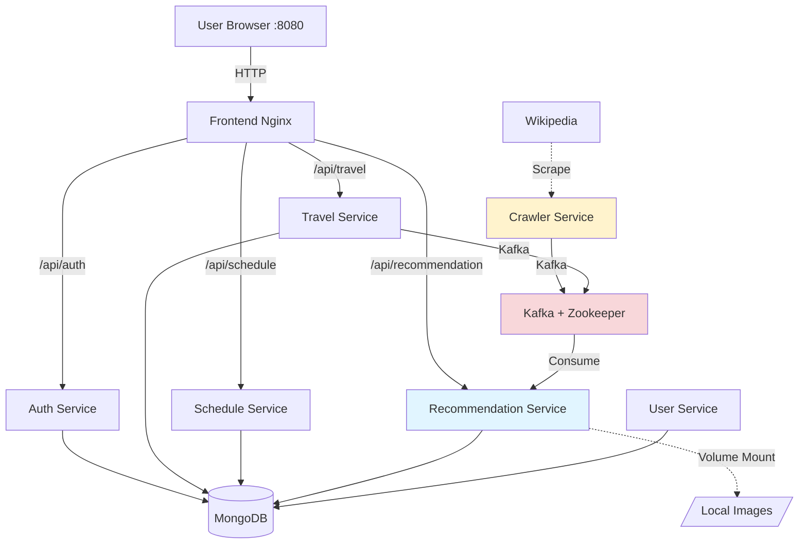

# MSA 여행 일정 관리 플랫폼

**Microservices Architecture** 기반의 여행 계획 및 추천 시스템

---

## 🏗️ 시스템 아키텍처



---

## 📋 주요 기능

### 1. 사용자 관리
- ✅ 회원가입 / 로그인 (JWT 인증)
- ✅ bcrypt 패스워드 암호화

### 2. 여행 계획
- ✅ 여행 계획 CRUD
- ✅ 이미지 업로드 (Drag & Drop, Base64)
- ✅ 자동 리사이징 (500KB 이하)

### 3. 일정 관리
- ✅ Activity 생성/삭제
- ✅ 시간 입력 (HH:MM)
- ✅ 이미지 첨부
- ✅ 자동 정렬 (날짜/시간순)

### 4. **여행지 추천 (AI 기반)**
- ✅ Wikipedia 실시간 크롤링 (2016/2018/최신 랭킹)
- ✅ 점수 기반 추천 알고리즘
  - Tag 매칭 (10점)
  - Season 매칭 (20점)
  - Travel Style 매칭 (15점)
  - Budget 매칭 (10점)
  - Popularity (0.1점)
- ✅ 국가별 이미지 자동 매핑
- ✅ Default 이미지 폴백

---

## 🏛️ 마이크로서비스 구성

| 서비스 | 역할 | 포트 | 기술 스택 |
|--------|------|------|-----------|
| **Frontend** | SPA + API Gateway | 8080 | Nginx, Vanilla JS, TailwindCSS |
| **Auth Service** | JWT 발급/검증 | 8000 | FastAPI, PyJWT |
| **User Service** | 계정 관리 | 8000 | FastAPI, Motor, bcrypt |
| **Travel Service** | 여행 계획 CRUD | 8000 | FastAPI, Motor, Kafka |
| **Schedule Service** | 일정 관리 | 8000 | FastAPI, Motor |
| **Recommendation Service** | 추천 + 이미지 서빙 | 8000 | FastAPI, Motor, Kafka, BeautifulSoup |
| **Crawler Service** | Wikipedia 크롤러 | - | Python, BeautifulSoup, Kafka |

---

## 🔄 데이터 플로우

### 크롤링 → 추천
```
Wikipedia
  ↓ BeautifulSoup (30초마다 5-10개 배치)
Crawler Service
  ↓ Kafka: external-travel-topic
Recommendation Service (Consumer)
  ↓ 국가명 정규화 + 이미지 매핑
MongoDB: destinations
  ↓ Aggregation Pipeline (점수 계산)
GET /api/recommendation/recommendations
  ↓
Frontend: "Recommended for You"
```

---

## 🚀 시작하기

### 사전 요구사항
- Docker & Docker Compose
- 8GB+ RAM (권장)

### 설치 및 실행

```bash
# 1. 저장소 클론
git clone <repository-url>
cd msa_travel_platform

# 2. 환경 변수 설정
cp .env.example .env
# .env 파일에서 JWT_SECRET 등 수정

# 3. Docker Compose 실행
docker compose up --build -d

# 4. 서비스 확인
docker compose ps

# 5. 브라우저 접속
http://localhost:8080
```

### 서비스 재시작
```bash
# 특정 서비스만 재시작
docker compose restart recommendation-service

# 전체 재시작
docker compose restart
```

### 로그 확인
```bash
# 실시간 로그
docker compose logs -f crawler-service

# 전체 로그
docker compose logs
```

---

## 📂 프로젝트 구조

```
msa_travel_platform/
├── auth-service/          # JWT 인증
├── user-service/          # 사용자 관리
├── travel-service/        # 여행 계획
├── schedule-service/      # 일정 관리
├── recommendation-service/ # 추천 엔진
├── crawler-service/       # Wikipedia 크롤러
├── frontend/
│   ├── public/
│   │   ├── index.html
│   │   └── js/
│   │       ├── app.js
│   │       ├── auth.js
│   │       ├── travel.js
│   │       └── schedule.js
│   └── nginx.conf
├── image/
│   └── recommended_image/  # 31개 국가 이미지
└── docker-compose.yml
```

---

## 🎨 주요 기술

### Backend
- **FastAPI**: 고성능 비동기 웹 프레임워크
- **Motor**: MongoDB 비동기 드라이버
- **AIOKafka**: 비동기 Kafka 클라이언트
- **BeautifulSoup**: 웹 스크래핑

### Frontend
- **Vanilla JavaScript**: 순수 JS (No Framework)
- **TailwindCSS**: 유틸리티 우선 CSS

### Infrastructure
- **MongoDB 6.0**: NoSQL 데이터베이스
- **Apache Kafka**: 이벤트 스트리밍
- **Docker Compose**: 컨테이너 오케스트레이션
- **Nginx**: 웹 서버 + API Gateway

---

## 🌟 최근 업데이트

### v2.0 (2026-01-03)
- ✅ **Default 이미지 폴백**: 매칭 실패 시 default.jfif 자동 사용
- ✅ **국가 중심 데이터**: title을 "Istanbul, Turkey" → "Turkey"로 변경
- ✅ **다중 테이블 크롤링**: 2016/2018/최신 랭킹 모두 지원
- ✅ **배치 처리**: 30초마다 5-10개 국가 동시 크롤링
- ✅ **하드코딩 제거**: "Trip to..." 자동 생성 로직 삭제

---

## 🔐 보안

- JWT 기반 인증/인가
- bcrypt 패스워드 해싱
- MongoDB 접근 제어
- Input Validation (Pydantic)

---

## 📊 성능 최적화

1. **IMAGE_CACHE**: 메모리 기반 이미지 캐싱 (파일 I/O 제거)
2. **MongoDB Aggregation**: DB 레벨 점수 계산
3. **Kafka**: 비동기 이벤트 처리
4. **Base64 압축**: Frontend에서 500KB 이하로 리사이징

---

## 🧪 테스트

### 크롤러 동작 확인
```bash
docker compose logs -f crawler-service | grep "Published"
```

### 추천 API 테스트
```bash
curl http://localhost:8080/api/recommendation/recommendations
```

### MongoDB 데이터 확인
```bash
docker exec -it msa_travel_platform-mongodb-1 mongosh -u user -p password
> use travel_db
> db.destinations.find({source: "External Crawler"}).limit(3)
```

---

## 📝 API 문서

| Endpoint | Method | 설명 |
|----------|--------|------|
| `/api/auth/login` | POST | 로그인 (JWT 발급) |
| `/api/auth/register` | POST | 회원가입 |
| `/api/travel/travels` | GET | 여행 목록 조회 |
| `/api/travel/travels` | POST | 여행 생성 |
| `/api/schedule/schedules/:id` | GET | 일정 조회 |
| `/api/schedule/schedules` | POST | 일정 생성 |
| `/api/recommendation/recommendations` | GET | 추천 목록 |
| `/api/recommendation/images/:country` | GET | 국가 이미지 |

---

## 🐛 트러블슈팅

### 컨테이너가 시작되지 않을 때
```bash
docker compose down
docker compose up --build --force-recreate
```

### MongoDB 초기화
```bash
docker volume rm msa_travel_platform_mongo_data
docker compose up -d mongodb
```

### Kafka 연결 오류
```bash
# Kafka 재시작
docker compose restart kafka zookeeper
```

---

## 🤝 기여

이슈와 PR은 언제나 환영합니다!

---

## 📄 라이선스

MIT License

---

## 👨‍💻 개발자

- **개발**: MSA Travel Platform Team
- **버전**: 2.0.0
- **업데이트**: 2026-01-03
