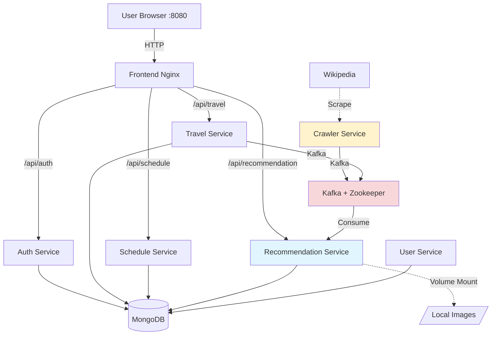

# MSA 여행 일정 관리 플랫폼

**Microservices Architecture** 기반의 여행 계획 및 추천 시스템

---

## 🏗️ 시스템 아키텍처


```mermaid
graph TB
    U[User Browser :8080] -->|HTTP| F[Frontend Nginx]
    F -->|/api/auth| AS[Auth Service]
    F -->|/api/travel| TS[Travel Service]
    F -->|/api/schedule| SS[Schedule Service]
    F -->|/api/recommendation| RS[Recommendation Service]
    
    W[Wikipedia] -.->|Scrape| CS[Crawler Service]
    CS -->|Kafka| K[Kafka + Zookeeper]
    TS -->|Kafka| K
    K -->|Consume| RS
    
    AS --> M[(MongoDB)]
    TS --> M
    SS --> M
    RS --> M
    US[User Service] --> M
    
    RS -.->|Volume Mount| I[/Local Images/]
    
    style RS fill:#e1f5ff
    style CS fill:#fff3cd
    style K fill:#f8d7da
```

---

## 📋 주요 기능

### 1. 사용자 관리
- ✅ 회원가입 / 로그인 (JWT 인증)
- ✅ bcrypt 패스워드 암호화

### 2. 여행 계획
- ✅ 여행 계획 CRUD
- ✅ 이미지 업로드 (Drag & Drop, Base64)
- ✅ 자동 리사이징 (500KB 이하)

### 3. 일정 관리
- ✅ Activity 생성/삭제
- ✅ 시간 입력 (HH:MM)
- ✅ 이미지 첨부
- ✅ 자동 정렬 (날짜/시간순)

### 4. **여행지 추천 (규칙 기반 점수 시스템)**
- ✅ Wikipedia 실시간 크롤링 (2016/2018/최신 랭킹)
- ✅ **가중치 기반 추천 알고리즘**
  - Tag 매칭: 10점 × 매칭된 태그 수
  - Season 매칭: 20점 (계절 일치 시)
  - Travel Style 매칭: 15점 (여행 스타일 일치 시)
  - Budget 매칭: 10점 (예산 레벨 일치 시)
  - Popularity 보너스: 인기도 × 0.1점
  - **총점 계산 후 랜덤 6개 선택**
- ✅ MongoDB Aggregation Pipeline 활용
- ✅ 국가별 이미지 자동 매핑 (정규화 + 별칭 처리)
- ✅ Default 이미지 폴백

---

## 🏛️ 마이크로서비스 구성

| 서비스 | 역할 | 포트 (내부:외부) | 기술 스택 |
|--------|------|-----------------|-----------|
| **Frontend** | SPA + API Gateway | 80:8080 | Nginx, Vanilla JS, TailwindCSS |
| **Auth Service** | JWT 발급/검증 | 8000 (내부) | FastAPI, PyJWT |
| **User Service** | 계정 관리 | 8000 (내부) | FastAPI, Motor, bcrypt |
| **Travel Service** | 여행 계획 CRUD | 8000 (내부) | FastAPI, Motor, Kafka |
| **Schedule Service** | 일정 관리 | 8000 (내부) | FastAPI, Motor |
| **Recommendation Service** | 추천 + 이미지 서빙 | 8000 (내부) | FastAPI, Motor, Kafka |
| **Crawler Service** | Wikipedia 크롤러 | - | Python, BeautifulSoup, Kafka |
| **MongoDB** | NoSQL Database | 27017:27017 | MongoDB 6.0 |
| **Kafka** | 메시지 브로커 | 9092:9092 (외부), 29092 (내부) | Apache Kafka |

---

## 🔄 데이터 플로우

### 크롤링 → 추천
```
Wikipedia
  ↓ BeautifulSoup (30초마다 5-10개 배치)
Crawler Service
  ↓ Kafka: external-travel-topic
Recommendation Service (Consumer)
  ↓ 국가명 정규화 + 이미지 매핑
MongoDB: destinations
  ↓ Aggregation Pipeline (점수 계산)
GET /api/recommendation/recommendations
  ↓
Frontend: "Recommended for You"
```

---

## 🚀 시작하기

### 사전 요구사항
- Docker & Docker Compose
- 8GB+ RAM (권장)

### 설치 및 실행

```bash
# 1. 저장소 클론
git clone <repository-url>
cd msa_travel_platform

# 2. 환경 변수 설정
cp .env.example .env
# .env 파일에서 JWT_SECRET 등 수정

# 3. Docker Compose 실행
cd docker-compose
docker compose up --build -d

# 4. 서비스 확인
docker compose ps

# 5. 브라우저 접속
http://localhost:8080
```

### ⛵ Kubernetes로 실행 (k3s / WSL2)

> **환경**: Ubuntu 24.04 LTS (WSL2) + k3s

#### 1단계. 사전 준비 (최초 1회)

```bash
# WSL2 inotify 한도 증가 — Kafka 기동에 필수
sudo sysctl -w fs.inotify.max_user_instances=512

# 재부팅 후에도 유지
echo "fs.inotify.max_user_instances=512" | sudo tee -a /etc/sysctl.conf
```

#### 2단계. Docker 이미지 빌드 및 k3s import

k3s는 Docker 데몬과 별도의 containerd를 사용하므로, `docker build` 후 반드시 `k3s ctr images import`로 가져와야 합니다.

```bash
cd msa_travel_platform

declare -A SERVICES=(
  ["user-service"]="msa-user-service:latest"
  ["auth-service"]="msa-auth-service:latest"
  ["travel-service"]="msa-travel-service:latest"
  ["schedule-service"]="msa-schedule-service:latest"
  ["recommendation-service"]="msa-recommendation-service:latest"
  ["crawler-service"]="msa-crawler-service:latest"
  ["frontend"]="msa-frontend:latest"
)

for svc in "${!SERVICES[@]}"; do
  docker build -t "${SERVICES[$svc]}" ./docker-compose/$svc
  docker save "${SERVICES[$svc]}" | sudo k3s ctr images import -
done
```

또는 스크립트로 한 번에:

```bash
bash k8s/setup-k3s.sh build
```

#### 3단계. 매니페스트 배포

```bash
cd k8s
kubectl apply -f 01-config.yaml
kubectl apply -f 02-mongodb.yaml
kubectl apply -f 03-zookeeper.yaml
kubectl apply -f 04-kafka.yaml
kubectl apply -f 05-user-service.yaml
kubectl apply -f 06-auth-service.yaml
kubectl apply -f 07-travel-service.yaml
kubectl apply -f 08-schedule-service.yaml
kubectl apply -f 09-recommendation-service.yaml
kubectl apply -f 10-crawler-service.yaml
kubectl apply -f 11-frontend.yaml

# 파드 상태 확인 (모두 Running이 될 때까지 대기, 약 1~2분 소요)
kubectl get pods
```

#### 4단계. 브라우저 접속

WSL2는 별도의 가상 네트워크에서 실행되므로 Windows 브라우저에서 `localhost`가 아닌 **WSL2 IP**로 접속해야 합니다.

```bash
# WSL2 IP 확인
ip addr show eth0 | grep 'inet '
# 예: inet 172.25.32.71/20
```

```
http://<WSL2_IP>:30080
```

> WSL2 IP는 재시작할 때마다 변경될 수 있으므로 매번 확인이 필요합니다.

### 서비스 재시작
```bash
# 특정 서비스만 재시작
docker compose restart recommendation-service

# 전체 재시작
docker compose restart
```

### 로그 확인
```bash
# 실시간 로그
docker compose logs -f crawler-service

# 전체 로그
docker compose logs
```

---

## 📂 프로젝트 구조

```
msa_travel_platform/
├── docker-compose/
│   ├── auth-service/          # JWT 인증 소스
│   ├── user-service/          # 사용자 관리 소스
│   ├── travel-service/        # 여행 계획 소스
│   ├── schedule-service/      # 일정 관리 소스
│   ├── recommendation-service/# 추천 엔진 소스
│   ├── crawler-service/       # Wikipedia 크롤러 소스
│   ├── frontend/              # 프론트엔드 소스
│   ├── image/                 # 이미지 파일
│   └── docker-compose.yml     # Docker Compose 설정
└── k8s/
    ├── auth-service/          # (k8s 실습용 독립 소스)
    ├── user-service/          # (k8s 실습용 독립 소스)
    ├── travel-service/        # (k8s 실습용 독립 소스)
    ├── schedule-service/      # (k8s 실습용 독립 소스)
    ├── recommendation-service/# (k8s 실습용 독립 소스)
    ├── crawler-service/       # (k8s 실습용 독립 소스)
    ├── frontend/              # (k8s 실습용 독립 소스)
    ├── image/                 # (k8s 실습용 독립 볼륨 데이터)
    ├── 01-config.yaml         # ConfigMap 및 Secret
    ├── 02-mongodb.yaml        # MongoDB 배포
    ├── 03-zookeeper.yaml      # Zookeeper 배포
    ├── 04-kafka.yaml          # Kafka 배포
    ├── 05-user-service.yaml   # User 서비스 배포
    ├── 06-auth-service.yaml   # Auth 서비스 배포
    ├── 07-travel-service.yaml # Travel 서비스 배포
    ├── 08-schedule-service.yaml # Schedule 서비스 배포
    ├── 09-recommendation-service.yaml # Recommendation 서비스 배포
    ├── 10-crawler-service.yaml # Crawler 서비스 배포
    └── 11-frontend.yaml       # Frontend 배포
```

---

## 🎨 주요 기술

### Backend
- **FastAPI**: 고성능 비동기 웹 프레임워크
- **Motor**: MongoDB 비동기 드라이버
- **AIOKafka**: 비동기 Kafka 클라이언트
- **BeautifulSoup**: 웹 스크래핑

### Frontend
- **Vanilla JavaScript**: 순수 JS (No Framework)
- **TailwindCSS**: 유틸리티 우선 CSS

### Infrastructure
- **MongoDB 6.0**: NoSQL 데이터베이스
- **Apache Kafka**: 이벤트 스트리밍
- **Docker Compose**: 컨테이너 오케스트레이션
- **Nginx**: 웹 서버 + API Gateway

---

## 🌟 최근 업데이트

### v2.0 (2026-01-03)
- ✅ **Default 이미지 폴백**: 매칭 실패 시 default.jfif 자동 사용
- ✅ **국가 중심 데이터**: title을 "Istanbul, Turkey" → "Turkey"로 변경
- ✅ **다중 테이블 크롤링**: 2016/2018/최신 랭킹 모두 지원
- ✅ **배치 처리**: 30초마다 5-10개 국가 동시 크롤링
- ✅ **하드코딩 제거**: "Trip to..." 자동 생성 로직 삭제

---

## 🔐 보안

- JWT 기반 인증/인가
- bcrypt 패스워드 해싱
- MongoDB 접근 제어
- Input Validation (Pydantic)

---

## 📊 성능 최적화

1. **IMAGE_CACHE**: 메모리 기반 이미지 캐싱 (파일 I/O 제거)
2. **MongoDB Aggregation**: DB 레벨 점수 계산
3. **Kafka**: 비동기 이벤트 처리
4. **Base64 압축**: Frontend에서 500KB 이하로 리사이징

---

## 🧪 테스트

### 크롤러 동작 확인
```bash
docker compose logs -f crawler-service | grep "Published"
```

### 추천 API 테스트
```bash
curl http://localhost:8080/api/recommendation/recommendations
```

### MongoDB 데이터 확인
```bash
docker exec -it msa_travel_platform-mongodb-1 mongosh -u user -p password
> use travel_db
> db.destinations.find({source: "External Crawler"}).limit(3)
```

---

## 📝 API 문서

| Endpoint | Method | 설명 |
|----------|--------|------|
| `/api/auth/login` | POST | 로그인 (JWT 발급) |
| `/api/auth/register` | POST | 회원가입 |
| `/api/travel/travels` | GET | 여행 목록 조회 |
| `/api/travel/travels` | POST | 여행 생성 |
| `/api/schedule/schedules/:id` | GET | 일정 조회 |
| `/api/schedule/schedules` | POST | 일정 생성 |
| `/api/recommendation/recommendations` | GET | 추천 목록 |
| `/api/recommendation/images/:country` | GET | 국가 이미지 |

---

## 🐛 트러블슈팅

### Docker Compose

#### 컨테이너가 시작되지 않을 때
```bash
docker compose down
docker compose up --build --force-recreate
```

#### MongoDB 초기화
```bash
docker volume rm msa_travel_platform_mongo_data
docker compose up -d mongodb
```

#### Kafka 연결 오류
```bash
docker compose restart kafka zookeeper
```

---

### Kubernetes (k3s / WSL2)

#### Kafka CrashLoopBackOff — `too many open files`

WSL2의 inotify 인스턴스 기본값(128)이 부족하여 발생합니다.

```bash
sudo sysctl -w fs.inotify.max_user_instances=512
kubectl rollout restart deployment/kafka
```

#### Kafka CrashLoopBackOff — `port is deprecated`

Kubernetes가 `kafka` 서비스의 `KAFKA_PORT` 환경변수를 파드에 자동 주입하면, Confluent 이미지의 시작 스크립트가 이를 deprecated 변수로 인식하고 종료합니다. `04-kafka.yaml`의 파드 스펙에 `enableServiceLinks: false`가 설정되어 있는지 확인하세요.

```yaml
# k8s/04-kafka.yaml
spec:
  template:
    spec:
      enableServiceLinks: false   # 이 설정이 있어야 합니다
```

#### 여행 생성 504 Gateway Timeout

Kafka가 다운된 상태에서 travel-service가 먼저 기동되면, Kafka producer 연결이 실패한 채로 남아 이후 요청이 블로킹됩니다. Kafka 정상화 후 재시작하세요.

```bash
kubectl rollout restart deployment/travel-service
```

#### Windows 브라우저에서 `localhost:30080` 접속 불가

WSL2는 NAT 기반 가상 네트워크를 사용하므로 Windows의 `localhost`가 WSL2 내부에 도달하지 않습니다. WSL2 IP로 접속하세요.

```bash
ip addr show eth0 | grep 'inet '
# 출력된 IP로 접속: http://<WSL2_IP>:30080
```

#### 재시작 후 Kafka 재기동 순서

```bash
# 1. inotify 재적용 (/etc/sysctl.conf 설정 시 자동 적용됨)
sudo sysctl -w fs.inotify.max_user_instances=512

# 2. 파드 상태 확인
kubectl get pods

# 3. kafka가 오류 상태이면 재시작
kubectl rollout restart deployment/kafka

# 4. kafka 정상화 후 travel-service 재시작
kubectl rollout restart deployment/travel-service
```

---

## 🤝 기여

이슈와 PR은 언제나 환영합니다!

---

## 📄 라이선스

MIT License

---

## 👨‍💻 개발자

- **개발**: MSA Travel Platform Team
- **버전**: 2.0.0
- **업데이트**: 2026-01-03
